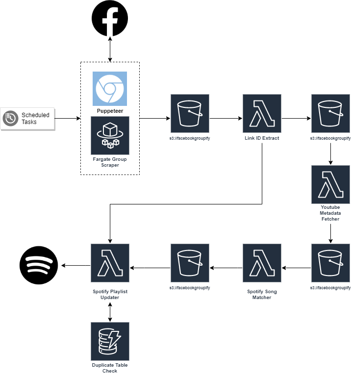

<h1 align="center">
  <br>
   Facebook Groupify
</h1>

<p align="center">
<a href="https://github.com/JackOHara/facebookgroupify/actions?query=workflow%3ABuild?branch=main"></a>
<a href="https://github.com/JackOHara/facebookgroupify/actions?query=workflow%3ADeployment"></a>
</p>

<p align="center">
  Facebook Groupify scrapes music links from posts in Facebook groups and collates them in a Spotify playlist.
</p>


## Table of Contents

* [How it works](#how-it-works)
* [Architecture](#architecture)
* [Local Development](#local-development)
* [Schedule a New Group for Scraping](#schedule-a-new-group-for-scraping)
* [Contributing](#contributing)
* [Deployments](#deployments)
* [Deployment Prerequisites](#deployment-prerequisites)
    * [Spotify API Credentials](#spotify-api-credentials)
    * [Facebook](#facebook)
    * [Set Credentials in SSM Parameter Store](#set-credentials-in-ssm-parameter-store)
* [Product Development](#product-development)

## How It Works
Facebook Groupify scrapes a Facebook Group using Puppeteer and collects external links that are posted into the group. These links are then parsed to retrieve Youtube IDs and Spotify IDs.

The Youtube IDs are used to fetch metadata like the title. The titles are then parsed and searched for Spotify. Fuzzy matching is then used on titles and artist names to determine if the youtube song is **probably** a match to the song found on Spotify. The Spotify ID of the match is then passed to the final stage of the application.

Spotify IDs are used to add songs to playlists (that correspond with the group they were originally scraped from).

## Architecture

<p align="center">  
<a href="https://drive.google.com/file/d/1tJdlG1rjz_DGWeln30z8vguZy2ArtEJM/view?usp=sharing"></a>
</p>

A scheduled job triggers a [scraping job](./resources/scraper_service) of a specific playlist/group combo. The Facebook group is scraped and links are saved in S3. This triggers the [Link Cleaner](./resources/functions/LinkCleaner) Lambda which extracts IDs from the links and the IDs are saved to S3. This triggers two Lambdas. 

- The Spotify IDs found are sent directly to the [Spotify Playlist Updater](./resources/functions/SpotifyPlaylistUpdater) Lambda which is responsible for updating the Spotify playlist with the found song. 
- Youtube IDs found are sent to the [Youtube Metadata](./resources/functions/YoutubeTitleFetcher) Lambda which fetches additional metadata about the song like the song title. The metadata is saved in S3 and the [Spotify Song Matcher](./resources/functions/YoutubeTitleToSpotifyId) Lambda is triggered. This attempts to match song titles found to songs that exist in Spotify. They don't need to be exactly the same but they need to be very similar. Found matches in Spotify are then saved to S3 which triggers the Spotify Playlist updater.

Before inserting a song into a Spotify playlist it checks DynamoDB to see if we have already inserted that song into the playlist. If not then we add it to the playlist and update our duplicate DynamoDB table to track it's insertion. This is used to prevent duplicate songs being inserted and because the Spotify API does not easily allow us to prevent duplicate insertions into a playlist.

There is quite a lot of saving to S3 and triggering events happening in this app. There are a few reasons behind this but the most important one is **replayability** of events. If a component further down the pipeline is improved later on we can retrigger the processing of data at any stage in the pipeline and thus provide more content with greater matching accuracy.


## Local Development
**TODO** 
```bash
git clone https://github.com/JackOHara/facebookgroupify/
```

## Schedule a New Group for Scraping

New groups for scraping can be added in the deployment code. Adding the following snippet to our [infrastructure code](./lib/facebookgroupify.js) and deploying will create a CloudWatch event which will trigger a scraping job once a day for the group.

```javascript
/*
  Parameters
  cluster: our ECS cluster (remains unchanged)
  groupId: ID representing the FB group (found at in group URL e.g. www.facebook.com/groups/288793014548229)
  playlistId: Spotify playlist ID
  runTime: how long (in minutes) the scraping job should run for (groups with high activity should have more time)
*/
this.scheduleScrape(cluster, '288793014548229', '3CcecGrE2ZZfWcRYx0seK2', 4);
```

This method of scheduling may change in the future as this is essentially user data and should not live in the code. It is not efficient/scalable to modify the code for every new group.

## Contributing
1. Follow the [Local Development](#local-development) steps to run the stack locally. 
2. Create a new branch and commit your change. 
3. Open a PR and wait for a review. Ensure the build is passing.
4. If the PR is approved then it will be merged to master.

## Deployments
On merge to master the stack will be deployed to a production AWS environment via GitHub Actions. The application code and infrastructure lives together as code using [AWS CDK](https://docs.aws.amazon.com/cdk/latest/guide/home.html).

To deploy from your machine install ```aws-cli``` and ```aws-cdk```. [Your AWS credentials will also need to be configured](https://docs.aws.amazon.com/cli/latest/userguide/cli-chap-configure.html). 
```bash
brew install aws-cli
npm i aws-cdk --global
```

Then to deploy
```bash
cd facebookgroupify
npm i
cdk deploy
```

## Deployment Prerequisites
To set up the application for the first time you will need to securely store your Spotify API and Facebook credentials. The following steps explain how to do this.
### Spotify API Credentials 
**TODO** Write script to retrieve them. 
### Facebook
To scrape Facebook the app uses your username and password, logs in and then saves the session cookies in SSM for later reuse. Multifactor authenication will need to be disabled to allow the app to login.
### Set credentials in SSM Parameter Store
Use the following script to store your credentials. Replace the values with the ones you retrieved in previous steps.
```bash
aws ssm put-parameter \
    --name "/FacebookGroupify/FacebookUsername" \
    --type "SecureString" \
    --value "billy.gates@hotmail.co.uk" \
    --overwrite

aws ssm put-parameter \
    --name "/FacebookGroupify/FacebookPassword" \
    --type "SecureString" \
    --value "guapo" \
    --overwrite

aws ssm put-parameter \
    --name "/FacebookGroupify/SpotifyClientId" \
    --type "SecureString" \
    --value "1234" \
    --overwrite

aws ssm put-parameter \
    --name "/FacebookGroupify/SpotifyClientSecret" \
    --type "SecureString" \
    --value "1234" \
    --overwrite

aws ssm put-parameter \
    --name "/FacebookGroupify/SpotifyRefreshToken" \
    --type "SecureString" \
    --value "1234" \
    --overwrite

aws ssm put-parameter \
    --name "/FacebookGroupify/SpotifyRedirectUri" \
    --type "String" \
    --value "http://localhost:3000/redirect" \
    --overwrite
```
If you are using a shared AWS account you may want to use a KMS key that only your IAM user and the application has access to.

## Product Development
Detailed explanations of the product, the future roadmap and the work to be done is documented in the [docs/product](./docs/product) folder. It's purpose is not just for organisation but it also acts as a scratch pad for any thoughts and ideas that come to my mind. 
